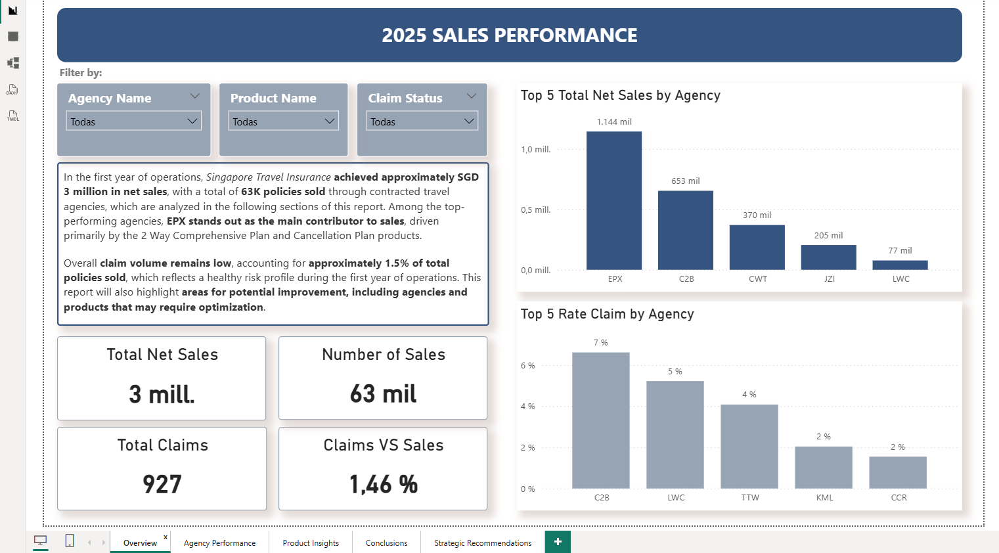
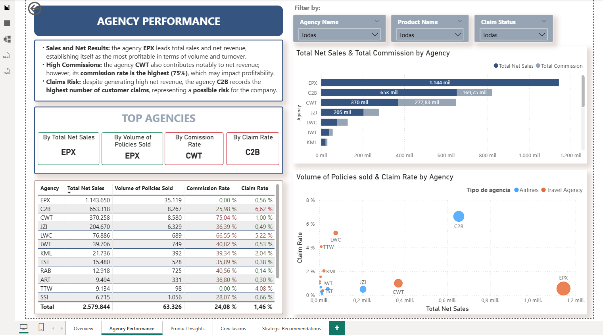
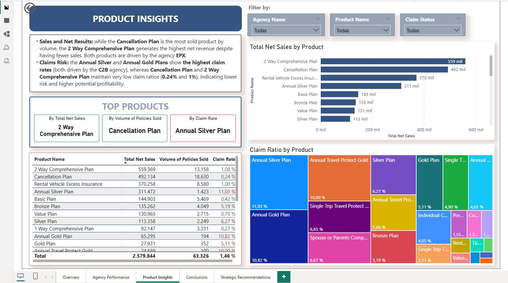
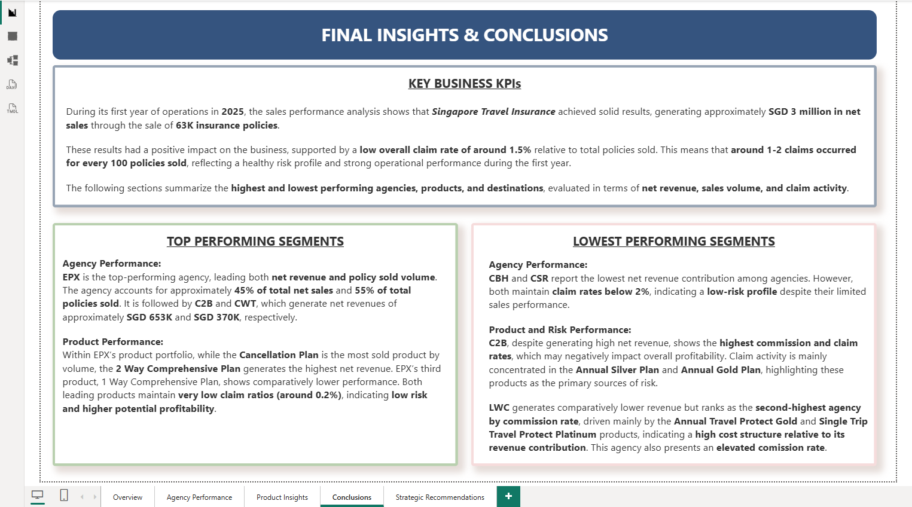
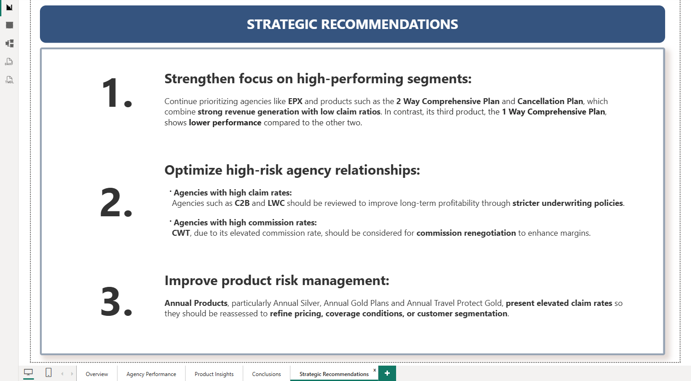

# Data Analysis & BI Project: Travel Insurance Sales
Data analysis project exploring a travel insurance company’s sales, agency and product performance, claims, and risk using MySQL and Power BI.

## 📁 Repository Structure

The repository is organized to separate different stages of the project for clarity:

- **README.md** – Project purpose, tools, methodology, insights, and limitations

- **/SQL/**  
  - `01_data_cleaning.sql` – Cleaning and standardization of raw data  
  - `02_create_tables.sql` – Creation of normalized tables and relationships  
  - `03_insert_data.sql` – Insert cleaned data into normalized tables  
  - `04_sanity_checks.sql` – Verify data integrity and relationships

- **/PowerBI/**  
  - `Travel_Insurance_Sales.pbix` – Final Power BI dashboard file  
  - **/screenshots/** – Screenshots of each dashboard page  
    - `01_overview.png`  
    - `02_agency_performance.png`  
    - `03_product_insights.png`  
    - `04_conclusions.png`  
    - `05_strategic_recommendations.png`
      
## 📎 Project Purpose 

This project was developed as part of a Data Analyst / Business Intelligence portfolio to demonstrate:

▪️End-to-end data analytics workflow.

▪️Strong SQL and relational modeling skills.

▪️Business-focused KPI analysis.

▪️Clear and actionable data visualization.

▪️Actionable insights to support data-driven decision-making.

## 🛠️ Tools

MySQL – Data cleaning, transformation, normalization, and relational modeling.

SQL – Analytical queries and KPI calculations.

Power BI – Interactive dashboards and data storytelling.

DAX – Measures for sales, claims, commissions, and performance indicators.

## 📌 Project Overview

This project presents an end-to-end data analytics workflow, covering data cleaning, transformation, relational modeling, and visualization, applied to a travel insurance company during its first year of operations.

All data preparation and modeling were performed in MySQL, while Power BI was used to build interactive dashboards.

The objective is to deliver actionable business insights to support decisions related to agency management, product strategy, and risk optimization.

## 🗂️ Dataset Description

The dataset was sourced from a publicly available dataset on Kaggle and represents a third-party travel insurance servicing company based in Singapore. It includes information on:

▪️Travel insurance agencies and distribution channels

▪️Insurance products

▪️Travel duration and destinations

▪️Net sales and commissions

▪️Claim status (Yes / No) 

## 🧹 Data Cleaning & Modeling (MySQL) 

The raw CSV dataset was fully processed in MySQL, including:

1️⃣ Data cleaning and standardization (e.g., trimming spaces, converting data types)

2️⃣ Creation of normalized tables and relational model with primary and foreign keys

3️⃣ Normalization into relational tables (agencies, products, sales)

4️⃣ Sanity checks to ensure data integrity before analysis

Final Data Model

The cleaned and structured database consists of:

▪️agencies: agency_id, agency_name, agency_type, distribution_channel

▪️products: product_id, product_name

▪️sales: sale_id, agency_id, product_id, claim_status, destination, duration, net_sales, commission

### 🧹 SQL Scripts

All SQL scripts used for data cleaning, table creation, normalization, and sanity checks are included here:

- [01_data_cleaning.sql](SQL/01_data_cleaning.sql) – Cleaning and standardizing raw CSV data  
- [02_create_tables.sql](SQL/02_create_tables.sql) – Creating normalized tables and relational model  
- [03_insert_data.sql](SQL/03_insert_data_cleaned.sql) – Inserting cleaned data into normalized tables  
- [04_sanity_checks.sql](SQL/04_sanity_checks.sql) – Verifying data integrity and relationships

## 📈 Power BI Dashboard Structure 

📊 KPI Measures & Power BI Dashboard

📥 [Download Power BI Dashboard (.pbix)](PowerBI/Travel_insurance_sales.pbix)

All key performance indicators (KPIs) were implemented directly in Power BI using DAX measures, leveraging the cleaned and normalized MySQL database.

### Dashboard Structure

  1️⃣ Overview: Total net sales and number of policies, Overall claim rate, High-level assessment of overall business performance.
  
  
  
  2️⃣ Agency Performance: Total sales, net revenue, claim risk, and commission rates by agency, Highlights top-performing and high-risk agencies.
  
  
  
  3️⃣ Product Insights: Sales and net revenue per product, Claim risk by product, Identification of most profitable and risk-heavy products.
  
  
  
  4️⃣ Conclusions & Recommendations: Summary of principal KPIs, Top and lowest performing segments (agencies and products), Strategic recommendations for business improvements.
  
   
  
### Key DAX Measures Examples

 ▪️ Total Sales: COUNT(sales[sale_id])
  
 ▪️ Net Revenue: SUM(sales[net_sales])
  
 ▪️ Claim Rate: DIVIDE([Total Claims], [Total Sales])
  
 ▪️ Average Net Sales per Claim: AVERAGEX(FILTER(sales, sales[claim_status] = "Yes"), sales[net_sales])
  
 ▪️ Top Performing Agencies and Products
  
  These measures enable dynamic, interactive dashboards, allowing drill-downs by agency or product and instant visual comparisons across key metrics.

⚡ Note: All final KPIs and interactive insights were implemented in Power BI using DAX measures. SQL queries (sanity_checks.sql) were used solely for data integrity verification and basic aggregation checks.

## 🔍 Key Insights 
- **High-performing agencies**: EPX drives 45% of total net revenue with low claim rate.

- **High-risk agencies**: C2B shows the highest claim rate; LWC has high commission rates.

- **High-performing products**: 2 Way Comprehensive Plan and Cancellation Plan generate the most revenue with minimal claims.

- **Risk-heavy products**: Annual Plans have high claim rates.

## ⚠️ Data Limitations & Assumptions 

- The analysis refers to the **first year of operations**, as no historical data was available for comparison. This assumption allows for benchmarking performance, but year-over-year trends cannot be assessed.
  
- No temporal breakdown (monthly or quarterly) is available; therefore, the analysis is performed on the dataset as a whole. If time-series data were available, it would be valuable to analyze trends, seasonality, and potential patterns across months.

- The dataset only includes **net sales and commission amounts**, without detailed information on operational costs, claim payouts, or margins.

- The **claim status variable is binary (Yes/No)** and does not include the monetary cost of claims. As a result, the analysis focuses on **claim frequency rather than claim severity**, and direct financial impact of claims could not be quantified.
